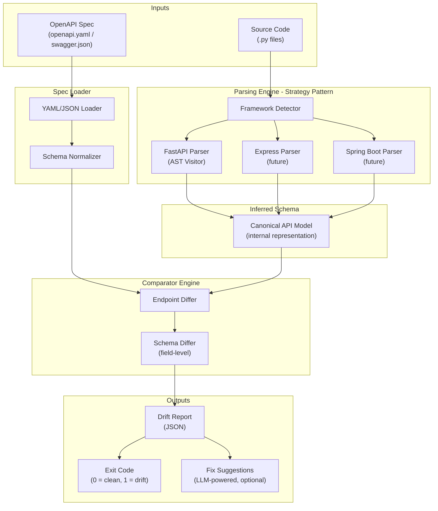
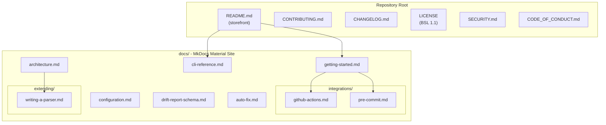

# DocGuard - Phase 1: Core Architecture, CLI, and Schema Design

## Decision: AST Parsing over Reflection

**We will use static AST parsing**, not runtime reflection. The rationale:


| Concern       | AST Parsing                                 | Runtime Reflection                     |
| ------------- | ------------------------------------------- | -------------------------------------- |
| Speed         | Fast, no imports needed                     | Requires loading entire app + deps     |
| Safety        | No code execution                           | Executes arbitrary project code        |
| CI/CD fit     | Zero runtime dependencies on target project | Must install target project's full env |
| Extensibility | Each framework gets its own visitor         | Tied to framework import mechanics     |


Python's built-in `ast` module will parse `.py` files into syntax trees. A **FastAPI visitor** will walk the tree looking for route decorators (`@app.get`, `@router.post`, etc.), extract path/method/parameters/response models, and then resolve Pydantic model definitions to infer field-level schemas.

---

## Step 1: Core Logic Architecture

### Data Flow




### Strategy Pattern - Parser Interface

Each framework parser implements a common `FrameworkParser` protocol:

```python
from typing import Protocol

class FrameworkParser(Protocol):
    """Strategy interface for framework-specific code parsers."""

    def can_handle(self, project_root: Path) -> bool:
        """Return True if this parser recognizes the framework in use."""
        ...

    def extract_endpoints(self, source_files: list[Path]) -> list[InferredEndpoint]:
        """Parse source files and return all discovered API endpoints."""
        ...
```

The `InferredEndpoint` is DocGuard's **canonical internal model** -- the common language between all parsers and the comparator:

```python
@dataclass
class InferredField:
    name: str
    type: str          # JSON Schema type: "string", "integer", "array", etc.
    required: bool
    nested: list["InferredField"] | None = None

@dataclass
class InferredEndpoint:
    path: str               # e.g. "/users/{user_id}"
    method: str             # GET, POST, PUT, DELETE, PATCH
    summary: str | None
    request_body: list[InferredField] | None
    response_fields: list[InferredField] | None
    response_status: int
    query_params: list[InferredField]
    path_params: list[InferredField]
    tags: list[str]
    source_file: str        # file:line for traceability
    source_line: int
```

### FastAPI Parser - How It Works

The FastAPI parser will use `ast.NodeVisitor` to:

1. **Discover route decorators** -- find calls to `app.get()`, `router.post()`, etc. Extract the path string, status code, tags, and summary from decorator arguments.
2. **Resolve function signatures** -- for each route handler, inspect the function parameters. Type annotations like `user_id: int` become path/query params. Parameters annotated with Pydantic `BaseModel` subclasses become request body schemas.
3. **Resolve Pydantic models** -- maintain a symbol table of all classes inheriting `BaseModel`. Walk their field definitions to build the `InferredField` tree (including nested models).

### Comparator Engine

The comparator takes two inputs:

- `list[InferredEndpoint]` from the parser
- `dict` from the loaded OpenAPI spec (parsed via `pyyaml` / `json`)

It normalizes the OpenAPI spec into the same `InferredEndpoint` format, then performs a **three-way classification** for each endpoint:

- **SYNCED** -- endpoint exists in both code and spec, all fields match
- **DRIFT** -- endpoint exists in both but fields/types/params differ (with a detailed sub-diff)
- **MISSING_IN_SPEC** -- endpoint found in code but absent from spec
- **MISSING_IN_CODE** -- endpoint defined in spec but no matching code found (possible dead docs)

---

## Step 2: CLI Interface Design

**Framework:** [Typer](https://typer.tiangolo.com/) -- modern, type-hint-based CLI built on Click, with automatic `--help` generation.

### Command Tree

```
docguard
  ├── init          Initialize .docguard.yaml config in the project root
  ├── check         Run drift detection (main CI/CD command)
  │     --spec, -s         Path to OpenAPI spec (default: auto-detect)
  │     --source, -d       Source directory to scan (default: ".")
  │     --framework, -f    Force framework (default: auto-detect)
  │     --format            Output format: "text" | "json" | "github"
  │     --fail-on           Threshold: "any" | "drift-only" | "missing"
  │     --ignore            Glob patterns for paths to ignore
  ├── fix           Suggest spec updates to resolve drift (LLM-powered)
  │     --spec, -s         Path to OpenAPI spec
  │     --apply             Apply fixes directly (default: dry-run)
  │     --model             LLM model to use (default: gpt-4o-mini)
  ├── report        Generate a full drift report JSON file
  │     --spec, -s         Path to OpenAPI spec
  │     --output, -o       Output file path (default: stdout)
  └── version       Print version info
```

### Exit Codes


| Code | Meaning                                        |
| ---- | ---------------------------------------------- |
| 0    | No drift detected -- spec and code are in sync |
| 1    | Drift detected -- spec and code have diverged  |
| 2    | Configuration or runtime error                 |


### Project Structure

```
docguard/
├── pyproject.toml              # Package config, dependencies, entry point
├── README.md
├── src/
│   └── docguard/
│       ├── __init__.py
│       ├── cli.py              # Typer app, command definitions
│       ├── config.py           # .docguard.yaml loader + defaults
│       ├── core/
│       │   ├── __init__.py
│       │   ├── models.py       # InferredEndpoint, InferredField, DriftReport
│       │   ├── comparator.py   # Endpoint diffing logic
│       │   └── spec_loader.py  # OpenAPI YAML/JSON loader + normalizer
│       ├── parsers/
│       │   ├── __init__.py
│       │   ├── base.py         # FrameworkParser protocol
│       │   ├── registry.py     # Auto-detect + parser registry
│       │   └── fastapi.py      # FastAPI AST visitor
│       ├── formatters/
│       │   ├── __init__.py
│       │   ├── text.py         # Human-readable terminal output
│       │   ├── json.py         # JSON drift report
│       │   └── github.py       # GitHub Actions annotations
│       └── fixers/
│           ├── __init__.py
│           └── llm_fixer.py    # LLM-powered spec update suggestions
├── tests/
│   ├── conftest.py
│   ├── fixtures/               # Sample FastAPI apps + OpenAPI specs
│   ├── test_fastapi_parser.py
│   ├── test_comparator.py
│   └── test_cli.py
└── action.yml                  # GitHub Action definition
```

### Key Dependencies

```
typer >= 0.12
pyyaml >= 6.0
rich >= 13.0           # Terminal output formatting
pydantic >= 2.0        # Internal config validation
openapi-spec-validator  # Validate spec files before comparison
```

---

## Step 3: Drift Report Schema

The Drift Report is the **single data contract** between the CLI, the GitHub Action output, and the future dashboard.

```json
{
  "$schema": "https://docguard.dev/schemas/drift-report-v1.json",
  "version": "1.0.0",
  "metadata": {
    "repository": "acme-corp/payments-api",
    "commit_sha": "a1b2c3d",
    "branch": "feature/add-refunds",
    "timestamp": "2026-04-03T14:22:00Z",
    "spec_path": "openapi.yaml",
    "framework_detected": "fastapi",
    "scan_duration_ms": 1240
  },
  "drift_score": 0.35,
  "summary": {
    "total_endpoints_in_code": 12,
    "total_endpoints_in_spec": 10,
    "synced": 7,
    "drifted": 3,
    "missing_in_spec": 2,
    "missing_in_code": 0
  },
  "endpoints": [
    {
      "path": "/payments/{payment_id}/refund",
      "method": "POST",
      "status": "missing_in_spec",
      "source_location": {
        "file": "src/routes/payments.py",
        "line": 87
      },
      "spec_location": null,
      "diffs": []
    },
    {
      "path": "/users/{user_id}",
      "method": "GET",
      "status": "drift",
      "source_location": {
        "file": "src/routes/users.py",
        "line": 23
      },
      "spec_location": {
        "json_path": "#/paths/~1users~1{user_id}/get"
      },
      "diffs": [
        {
          "type": "field_added_in_code",
          "location": "response.body.email_verified",
          "code_value": { "type": "boolean", "required": true },
          "spec_value": null,
          "severity": "error",
          "message": "Field 'email_verified' (boolean) exists in code response but is missing from the spec."
        },
        {
          "type": "type_mismatch",
          "location": "response.body.age",
          "code_value": { "type": "string" },
          "spec_value": { "type": "integer" },
          "severity": "error",
          "message": "Field 'age' is 'string' in code but 'integer' in spec."
        }
      ]
    },
    {
      "path": "/users",
      "method": "GET",
      "status": "synced",
      "source_location": {
        "file": "src/routes/users.py",
        "line": 10
      },
      "spec_location": {
        "json_path": "#/paths/~1users/get"
      },
      "diffs": []
    }
  ]
}
```

### Drift Score Calculation

The `drift_score` is a float from `0.0` (perfectly synced) to `1.0` (completely out of sync), calculated as:

```
drift_score = (drifted * 1.0 + missing_in_spec * 1.0 + missing_in_code * 0.5) / total_unique_endpoints
```

- **Drifted** and **missing_in_spec** carry full weight (1.0) -- these are real integration risks.
- **missing_in_code** carries half weight (0.5) -- could be deprecated endpoints that just need cleanup.

### Diff Severity Levels


| Severity  | Meaning                                                        | CI Behavior     |
| --------- | -------------------------------------------------------------- | --------------- |
| `error`   | Breaking change: type mismatch, missing required field         | Fails the build |
| `warning` | Non-breaking: new optional field in code, description mismatch | Configurable    |
| `info`    | Cosmetic: tag changes, summary differences                     | Never fails     |


---

## Key Architectural Decisions Summary

1. **Language:** Python 3.11+ (matches primary target framework FastAPI, leverages `ast` stdlib)
2. **Parsing:** Static AST analysis via `ast.NodeVisitor` -- no runtime imports, no dependency on target project
3. **Extensibility:** Strategy Pattern via `FrameworkParser` protocol -- new frameworks are added as new modules in `parsers/`
4. **Output:** Structured JSON drift report as the single data contract for CLI, CI, and dashboard
5. **CI integration:** Exit code 1 on drift, with `--format github` for native GitHub Actions annotations

---

## Step 4: Commercial Documentation Strategy

DocGuard is a product, not a side project. The documentation must serve **three distinct audiences**: users evaluating and adopting the tool, engineers contributing to it, and an acquiring company performing due diligence. Every document below is designed with one or more of those audiences in mind.

### Documentation Architecture




### Updated Project Structure (with docs)

```
docguard/
├── README.md                       # Product "storefront" - first thing users and acquirers see
├── LICENSE                         # BSL 1.1 (commercial protection)
├── CONTRIBUTING.md                 # Developer onboarding and PR guidelines
├── CHANGELOG.md                    # Keep a Changelog format
├── SECURITY.md                     # Vulnerability disclosure policy
├── CODE_OF_CONDUCT.md              # Contributor Covenant v2.1
├── mkdocs.yml                      # MkDocs Material site configuration
├── pyproject.toml
├── src/
│   └── docguard/
│       └── ...                     # (as defined in Step 2)
├── tests/
│   └── ...
├── docs/
│   ├── index.md                    # Docs site landing page (mirrors README hero)
│   ├── getting-started.md          # Install + 5-minute quickstart
│   ├── cli-reference.md            # Every command, flag, and exit code
│   ├── configuration.md            # .docguard.yaml full schema reference
│   ├── drift-report-schema.md      # JSON drift report specification
│   ├── architecture.md             # System design, data flow, design patterns
│   ├── auto-fix.md                 # LLM fixer: setup, models, cost
│   ├── integrations/
│   │   ├── github-actions.md       # GitHub Actions workflow setup
│   │   └── pre-commit.md           # pre-commit hook integration
│   ├── extending/
│   │   └── writing-a-parser.md     # Tutorial: add a new framework parser
│   └── assets/
│       ├── logo.svg                # DocGuard logo (placeholder)
│       └── terminal-demo.gif       # Animated CLI demo (placeholder)
└── action.yml
```

---

### 4.1 README.md -- The Storefront

The README is the single most important marketing asset. It must convince a developer to try DocGuard within 30 seconds of landing on the GitHub page. Structure:

1. **Hero block** -- Logo, one-line tagline ("Your API spec is a lie. DocGuard fixes that."), and badges (PyPI version, license, CI status, downloads)
2. **Problem statement** -- 2-3 sentences on documentation drift and the cost to teams
3. **Animated demo** -- A terminal GIF showing `docguard check` catching a drift in real time
4. **Quick install** -- `pip install docguard` and a 3-line quickstart
5. **Feature matrix** -- A clean comparison of what DocGuard does vs. manual spec maintenance
6. **How it works** -- The Mermaid data flow diagram from Step 1
7. **Integrations** -- One-liner code blocks for GitHub Actions and pre-commit
8. **Pricing** -- Link to pricing page; mention the free tier for open source
9. **Links** -- Docs site, Contributing, Changelog, Security, License

### 4.2 docs/getting-started.md -- First Five Minutes

A hands-on walkthrough that takes a developer from zero to a passing `docguard check` in under 5 minutes. Structure:

1. **Prerequisites** -- Python 3.11+, pip
2. **Install** -- `pip install docguard`
3. **Initialize** -- `docguard init` in a sample FastAPI project (we provide the sample)
4. **Run your first check** -- `docguard check` against a correct spec (green output)
5. **Introduce drift** -- Add a new field to a Pydantic model without updating the spec
6. **See the failure** -- `docguard check` catches it (red output with specific diff)
7. **Auto-fix** -- `docguard fix --apply` resolves it
8. **Next steps** -- Links to CI integration guides

### 4.3 docs/cli-reference.md -- Complete CLI Reference

Auto-generated where possible (Typer supports `typer utils docs`), manually enriched with:

- Full description of every command (`init`, `check`, `fix`, `report`, `version`)
- Every flag and option with type, default, and description
- Exit codes table
- Real-world usage examples for each command
- Environment variable overrides (e.g., `DOCGUARD_SPEC_PATH`, `DOCGUARD_LLM_API_KEY`)

### 4.4 docs/configuration.md -- Configuration Reference

Full reference for `.docguard.yaml` with annotated examples:

```yaml
# .docguard.yaml -- DocGuard configuration
spec: openapi.yaml                # Path to OpenAPI spec file
source: src/                      # Directory to scan for API code
framework: auto                   # auto | fastapi | express | spring
ignore:
  - "*/tests/*"                   # Glob patterns to exclude
  - "*/migrations/*"
check:
  fail_on: any                    # any | drift-only | missing
  severity_threshold: warning     # error | warning | info
fix:
  model: gpt-4o-mini              # LLM model for auto-fix
  api_key_env: OPENAI_API_KEY     # Env var containing the API key
output:
  format: text                    # text | json | github
  report_path: null               # If set, write JSON report to this path
```

### 4.5 docs/drift-report-schema.md -- Drift Report Specification

This is a formal schema reference aimed at teams building dashboards or integrations on top of DocGuard output. Includes:

- Full JSON Schema definition (published at a stable URL)
- Field-by-field descriptions with types and constraints
- Example reports for each endpoint status (synced, drift, missing_in_spec, missing_in_code)
- Drift score calculation formula and rationale
- Severity level definitions and CI behavior mapping
- Versioning policy for the schema (semver, backward compatibility guarantees)

### 4.6 docs/architecture.md -- For Contributors and Acquirers

This document answers the question: "How does DocGuard actually work, and is the codebase sound?" Critical for acquisition due diligence. Includes:

- High-level system diagram (the Mermaid flowchart from Step 1)
- Module dependency graph
- Strategy Pattern explanation with class diagram
- Data lifecycle: source file -> AST -> InferredEndpoint -> comparison -> DriftReport
- Performance characteristics and benchmarks
- Design decisions log (AST vs. reflection, why Typer, why BSL)
- Test coverage philosophy and targets

### 4.7 docs/integrations/ -- CI/CD Guides

**github-actions.md:**

```yaml
# .github/workflows/docguard.yml
name: DocGuard Drift Check
on: [pull_request]
jobs:
  check:
    runs-on: ubuntu-latest
    steps:
      - uses: actions/checkout@v4
      - uses: docguard/action@v1
        with:
          spec: openapi.yaml
          fail-on: any
```

- Step-by-step setup with screenshots of PR check annotations
- Configuration options for the GitHub Action
- How to use `--format github` for inline PR annotations

**pre-commit.md:**

```yaml
# .pre-commit-config.yaml
repos:
  - repo: https://github.com/docguard/docguard
    rev: v0.1.0
    hooks:
      - id: docguard-check
        args: [--spec, openapi.yaml]
```

### 4.8 docs/extending/writing-a-parser.md -- Extensibility Tutorial

A step-by-step guide for adding a new framework parser (e.g., Express.js). Covers:

1. Creating a new file in `src/docguard/parsers/`
2. Implementing the `FrameworkParser` protocol
3. Writing `can_handle()` to detect the framework (e.g., check for `package.json` with express dependency)
4. Writing `extract_endpoints()` with framework-specific AST/parsing logic
5. Registering the parser in `registry.py`
6. Writing tests with fixture projects
7. Submitting a PR

### 4.9 docs/auto-fix.md -- LLM-Powered Fixes

Explains the `docguard fix` command:

- How it works: takes the drift report, constructs a prompt, asks an LLM for the YAML patch
- Supported LLM providers (OpenAI, Anthropic, local models via Ollama)
- API key configuration
- Cost estimates per scan (token usage for typical drift reports)
- `--apply` vs. dry-run mode
- Accuracy expectations and human review recommendations

---

### 4.10 Repository Governance Documents

**CONTRIBUTING.md** -- Developer onboarding:

- Development environment setup (clone, `pip install -e ".[dev]"`, pre-commit install)
- Code style (Ruff for linting/formatting, strict type hints)
- Branch naming conventions
- PR template and review process
- Issue and feature request templates
- CLA (Contributor License Agreement) reference -- critical for commercial IP protection

**CHANGELOG.md** -- Following [Keep a Changelog](https://keepachangelog.com/) format:

- Initialized with `v0.1.0 - Unreleased`
- Categories: Added, Changed, Deprecated, Removed, Fixed, Security
- Every user-facing change gets an entry; this is what acquirers and enterprise customers review

**LICENSE** -- Business Source License 1.1 (BSL):

- Allows free use for small teams and open-source projects
- Requires a paid license for production use above a threshold (e.g., > 5 private repos)
- Converts to Apache 2.0 after a set period (e.g., 36 months) -- this is attractive to acquirers because it shows a path to open source while protecting near-term revenue
- Alternative: the Functional Source License (FSL) is also worth considering

**SECURITY.md** -- Standard vulnerability disclosure policy:

- How to report (dedicated email: [security@docguard.dev](mailto:security@docguard.dev))
- What to expect (acknowledgment within 48 hours, fix within 14 days for critical)
- Supported versions
- No public disclosure before fix is available

**CODE_OF_CONDUCT.md** -- Contributor Covenant v2.1 (industry standard)

---

### 4.11 Documentation Site Setup (MkDocs Material)

The docs will be built as a static site using [MkDocs](https://www.mkdocs.org/) with the [Material for MkDocs](https://squidfundamentals.github.io/mkdocs-material/) theme -- the gold standard for Python project documentation.

**mkdocs.yml:**

```yaml
site_name: DocGuard
site_url: https://docs.docguard.dev
site_description: Eliminate API documentation drift. Your spec becomes a test case.
repo_url: https://github.com/docguard/docguard
repo_name: docguard/docguard

theme:
  name: material
  palette:
    - scheme: default
      primary: deep purple
      accent: amber
      toggle:
        icon: material/brightness-7
        name: Switch to dark mode
    - scheme: slate
      primary: deep purple
      accent: amber
      toggle:
        icon: material/brightness-4
        name: Switch to light mode
  features:
    - navigation.instant
    - navigation.tracking
    - navigation.tabs
    - content.code.copy
    - content.code.annotate
    - search.highlight

nav:
  - Home: index.md
  - Getting Started: getting-started.md
  - CLI Reference: cli-reference.md
  - Configuration: configuration.md
  - Drift Report Schema: drift-report-schema.md
  - Integrations:
    - GitHub Actions: integrations/github-actions.md
    - Pre-commit Hooks: integrations/pre-commit.md
  - Auto-Fix (LLM): auto-fix.md
  - Architecture: architecture.md
  - Extending:
    - Writing a Parser: extending/writing-a-parser.md

markdown_extensions:
  - admonitions
  - pymdownx.highlight
  - pymdownx.superfences
  - pymdownx.tabbed
  - pymdownx.details
  - toc:
      permalink: true

plugins:
  - search
  - social
```

**Deployment:** GitHub Pages via GitHub Actions -- `mkdocs gh-deploy` on every push to `main`. The docs site at `docs.docguard.dev` becomes the canonical reference.

---

### Documentation Priority Order

For the MVP, documents will be created in this order (highest impact first):

1. **README.md** -- immediate credibility signal for GitHub visitors
2. **docs/getting-started.md** -- converts visitors into users
3. **docs/cli-reference.md** -- users need this on day one
4. **docs/configuration.md** -- users need this to customize
5. **docs/integrations/github-actions.md** -- the primary distribution channel
6. **LICENSE** -- legal protection before any public release
7. **CONTRIBUTING.md** -- enables community contributions
8. **CHANGELOG.md** -- professionalism signal
9. **SECURITY.md** -- enterprise requirement
10. **docs/architecture.md** -- acquirer due diligence
11. **docs/drift-report-schema.md** -- ecosystem integrations
12. **docs/extending/writing-a-parser.md** -- community growth
13. **docs/auto-fix.md** -- premium feature documentation
14. **docs/integrations/pre-commit.md** -- secondary distribution
15. **CODE_OF_CONDUCT.md** -- community health

