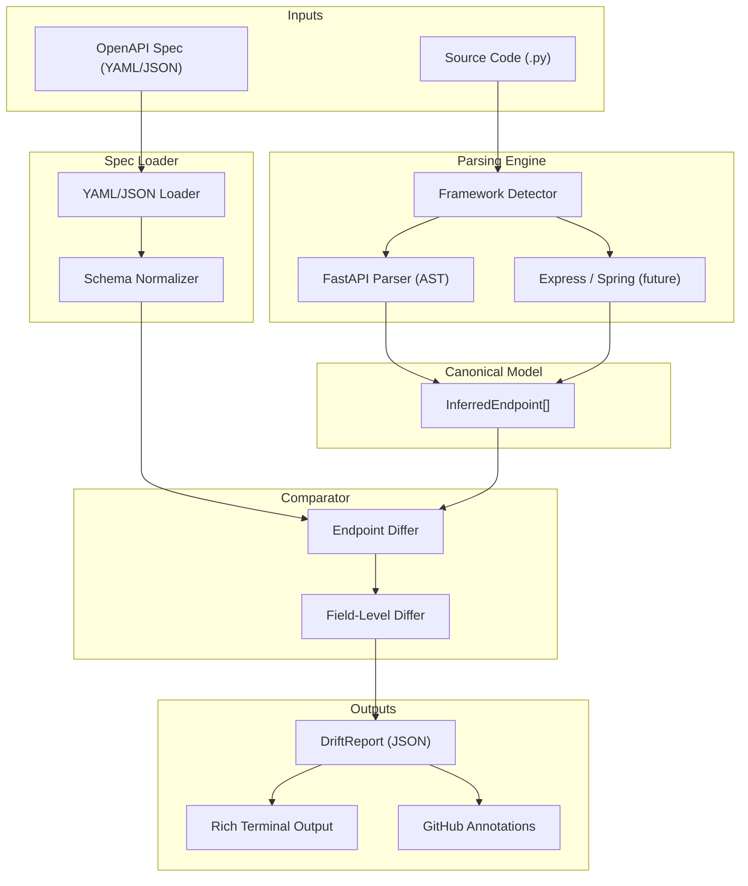
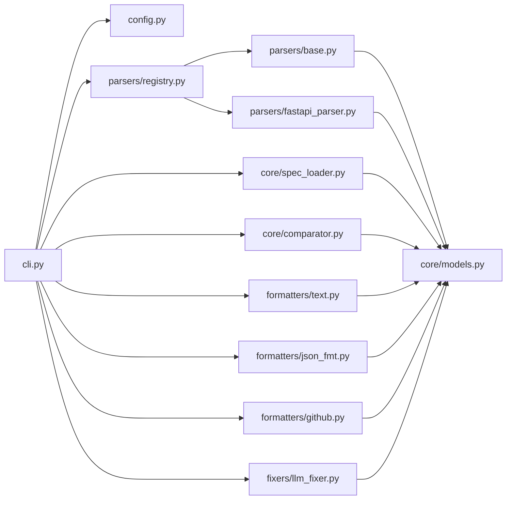

# Architecture

This document describes DocGuard's internal architecture. It is intended for contributors, code reviewers, and anyone performing technical due diligence.

## System Overview

DocGuard is a stateless CLI tool that compares two representations of an API:

1. **The code** -- what the API actually does, inferred via static AST analysis
2. **The spec** -- what the API is documented to do, loaded from an OpenAPI YAML/JSON file

Both are normalized into the same canonical model, then diffed to produce a structured drift report.



## Key Design Decisions

### AST Parsing over Runtime Reflection

DocGuard uses Python's built-in `ast` module to parse source files into syntax trees. This was chosen over runtime reflection (importing the FastAPI app and inspecting it) for several reasons:

| Concern | AST Parsing | Runtime Reflection |
|---------|-------------|-------------------|
| Speed | Fast, no imports | Must load entire app + dependencies |
| Safety | No code execution | Executes arbitrary project code |
| CI/CD fit | Zero runtime dependencies on the target project | Must install target project's full environment |
| Extensibility | Each framework gets its own visitor | Tied to framework import mechanics |

### Strategy Pattern for Framework Support

Each framework parser implements the `FrameworkParser` protocol:

```python
class FrameworkParser(Protocol):
    @property
    def name(self) -> str: ...
    def can_handle(self, project_root: Path) -> bool: ...
    def extract_endpoints(self, source_files: list[Path]) -> list[InferredEndpoint]: ...
```

The parser registry auto-detects the framework by calling `can_handle()` on each registered parser. New frameworks are added by implementing this protocol and registering the parser -- no changes to core logic required.

### Canonical Model

All parsers output `InferredEndpoint` objects. The spec loader also normalizes into `InferredEndpoint`. This decouples parsing from comparison -- the comparator has no knowledge of FastAPI, Express, or any specific framework.

## Module Dependency Graph



Key invariant: `core/models.py` has no internal imports. It is the foundation that all other modules depend on.

## Data Lifecycle

```
Source File (.py)
  │
  ▼
AST Parse (ast.parse)
  │
  ▼
Pydantic Model Collector (first pass -- builds symbol table of BaseModel classes)
  │
  ▼
Route Visitor (second pass -- finds @app.get/@router.post decorators)
  │
  ▼
InferredEndpoint[] (canonical model)
  │                               OpenAPI Spec (.yaml/.json)
  │                                       │
  │                                       ▼
  │                               YAML/JSON Parse (pyyaml/json)
  │                                       │
  │                                       ▼
  │                               Schema Normalizer
  │                                       │
  │                                       ▼
  │                               InferredEndpoint[] (canonical model)
  │                                       │
  ▼                                       ▼
  └──────────────► Comparator ◄───────────┘
                       │
                       ▼
                  DriftReport
                       │
              ┌────────┼────────┐
              ▼        ▼        ▼
           Text     JSON     GitHub
          Output   Output   Annotations
```

## FastAPI Parser Internals

The FastAPI parser operates in two passes over the AST:

**Pass 1: Pydantic Model Collection** (`_PydanticModelCollector`)

- Walks all `ClassDef` nodes
- Identifies classes that inherit from `BaseModel` (or contain "Schema" in a base name)
- Extracts field names, types, required/optional status, and defaults
- Builds a symbol table: `dict[str, list[InferredField]]`

**Pass 2: Route Extraction** (`_RouteVisitor`)

- Walks all `FunctionDef` and `AsyncFunctionDef` nodes
- Checks decorators for calls to `app.get()`, `router.post()`, etc.
- Extracts path, method, status_code, tags, summary from decorator arguments
- Resolves function parameters into path params, query params, and request body (using the symbol table from Pass 1)
- Resolves `response_model` keyword to get response fields

## Comparator Algorithm

The comparator performs a three-way classification:

1. Build a map of `"METHOD /path" -> InferredEndpoint` for both code and spec
2. For each unique key:
   - Present in code only: `MISSING_IN_SPEC`
   - Present in spec only: `MISSING_IN_CODE`
   - Present in both: deep-compare fields, params, status codes
3. Deep comparison is recursive (handles nested Pydantic models) and produces `FieldDiff` objects with severity classification

## Performance

DocGuard is designed to run in CI pipelines and pre-commit hooks. Performance characteristics:

- **AST parsing**: ~1-5ms per Python file
- **Comparison**: O(n) where n = number of endpoints
- **Typical scan**: < 2 seconds for projects with up to 50 endpoints
- **No network calls** (except when using `docguard fix`, which calls the LLM API)

## Test Architecture

Tests are organized by module:

- `test_fastapi_parser.py` -- Unit tests for AST extraction using fixture FastAPI apps
- `test_comparator.py` -- Tests comparing known-good and known-drifted spec/code pairs
- `test_cli.py` -- Integration tests using Typer's `CliRunner` with temp directories

Fixtures live in `tests/fixtures/` and include a sample FastAPI app, a matching spec, and an intentionally drifted spec.
